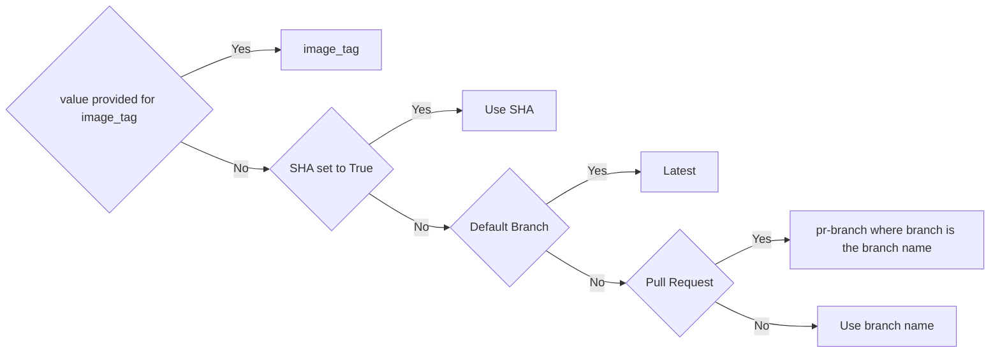

# ECR Build - Tag - Publish

This GitHub Action will build, tag, and publish your ecr image.  The logic has been designed for our use case, but can be modifed for yours.

The image name will default to be the same as the GitHub Repo.  

# Default Tagging Logic
The tagging logic works as follows:
1. If you have a value for `image_tag` then we will use that value.
2. If you set `use_sha` to `true` then we will use the SHA
3. If this is the default branch, then the tag will be `latest`
4. if this is a pull request, the the tag will be `pr-branch` where branch is the branch name.
5. Otherwise, we'll use the branch name or tag value.



### Inputs

The following can be used as `step.with` keys.  T/F types expect true or false.  Req is required.

| Name             | Type    | Req | Description                  | Default |
|------------------|---------|-----|------------------------------|---------|
| `aws_login` | T/F | No | Use action builtin login (AWS login action) | `true` |
| `aws_access_key_id` | String | No | AWS access key ID ||
| `aws_secret_access_key` | String | No | AWS secret access key ||
| `aws_session_token` | String | No | AWS session token ||
| `checkout` | T/F | No | Determines if we should chckout the repository.  Set to `false` if this is being done in an eariler step | `true` |
| `aws_default_region` | String | No | AWS default region. Defaults to `us-east-1` ||
| `aws_ecr_repo_name` | String | Yes | AWS ECR repository name. e.g. hello-repository ||
| `image_tag` | string | No | Use this tag instead of the tagging logic.  | See tagging logic |
| `use_latest` | T/F | No | The default branch gets a latest tag | `true` |
| `use_sha` | T/F | No | Set to `true` to use the SHA for the tag. | `false` |
| `org_name` | string | No | Your org name.   | GitHub Org Name |
| `build_args` | string | No | Add arbitrary build arguments | N/A |
| `working_directory` | string | No | Specifies the working directory for the Docker Build step | N/A |


## Example 1

This will checkout the code, build, tag and push using the default tags. 

```yaml
-   id: ecr-publish
    uses: bitovi/github-actions-ecr-publish@v0.1.0
      with:
        aws_access_key_id: ${{ secrets.AWS_ACCESS_KEY_ID }}
        aws_secret_access_key: ${{ secrets.AWS_SECRET_ACCESS_KEY }}
        aws_default_region: us-east-1
        aws_ecr_repo_name: hello-repo
```

## Example 2

Here we check the code out since we make a change before the build / publish step.  We also show how to get the image and tag for later use in the same job.

```yaml
  steps:
    - name: Checkout 
      uses: actions/checkout@v3
    - name: do something to the code
      run: echo "Changed code" > text.txt
    - id: ecr-publish
      name: Build image
      uses: bitovi/github-actions-ecr-publish@v0.1.0
      with:
        checkout: 'false'
        image_tag: it
        use_sha: 'true' # won't do anything since image_tag is set
        org_name: bitovi
        aws_ecr_repo_name: deploy-eks-helm
        build_args: --build-arg git_personal_token=PAT_token
        working_directory: ./app/inner-folder
    - run: |
        echo "Image Created:  ${{ env.image }}"
        echo "Tag Created: ${{ env.tag }}"
```

## License
The scripts and documentation in this project are released under the [MIT License](https://github.com/bitovi/github-actions-ecr-publish/blob/main/LICENSE).

## Provided by Bitovi
[Bitovi](https://www.bitovi.com/) is a proud supporter of Open Source software.

## Customize
Please feel free to copy and customize this action for your specific use case, just give some credit to Bitovi as the orignal authors.  

## Need help or have questions?
You can **get help or ask questions** on [Discord channel](https://discord.gg/J7ejFsZnJ4)! Come hangout with us!

Or, you can hire us for training, consulting, or development. [Set up a free consultation](https://www.bitovi.com/devops-consulting).
